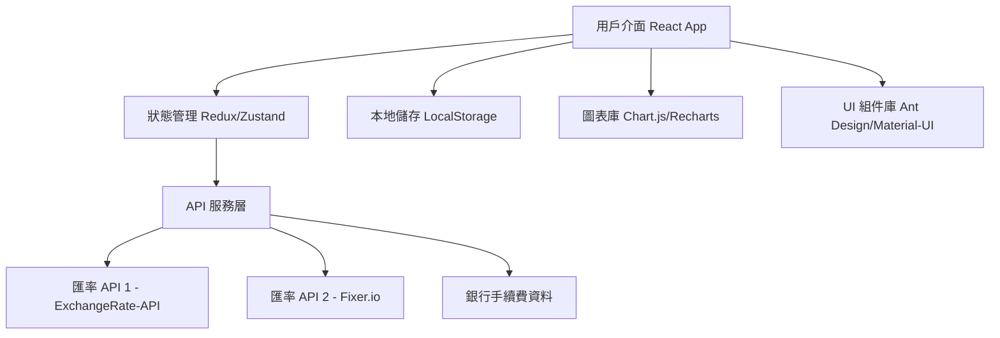

# Design Document

## Overview

外幣兌換比較平台是一個基於 React.js 的單頁應用程式，整合多個免費匯率 API 來提供即時的外幣兌換比較服務。系統採用前端為主的架構，利用瀏覽器本地儲存來管理用戶資料，並通過第三方 API 獲取即時匯率資訊。

## Architecture

### System Architecture



### Technology Stack

- **前端框架**: React.js 18+ with TypeScript
- **狀態管理**: Zustand (輕量級狀態管理)
- **UI 組件庫**: Ant Design (支援繁體中文)
- **圖表庫**: Recharts (React 原生圖表庫)
- **樣式**: Tailwind CSS + Ant Design
- **HTTP 客戶端**: Axios
- **路由**: React Router v6
- **建置工具**: Vite
- **部署**: Vercel/Netlify

## Components and Interfaces

### Core Components

#### 1. CurrencyInput Component
```typescript
interface CurrencyInputProps {
  amount: number;
  onAmountChange: (amount: number) => void;
  currency: string;
  disabled?: boolean;
}
```

#### 2. ExchangeComparison Component
```typescript
interface ExchangeComparisonProps {
  twdAmount: number;
  exchangeRates: ExchangeRate[];
  bankFees: BankFee[];
  selectedCurrencies: string[];
}
```

#### 3. TrendChart Component
```typescript
interface TrendChartProps {
  currencyPair: string;
  historicalData: HistoricalRate[];
  timeRange: '7d' | '30d' | '90d';
}
```

#### 4. RecommendationCard Component
```typescript
interface RecommendationCardProps {
  recommendation: CurrencyRecommendation;
  onSelect: (recommendation: CurrencyRecommendation) => void;
  isSelected: boolean;
}
```

### Data Models

#### ExchangeRate Model
```typescript
interface ExchangeRate {
  id: string;
  baseCurrency: string;
  targetCurrency: string;
  rate: number;
  timestamp: Date;
  source: 'exchangerate-api' | 'fixer' | 'bank-official';
}
```

#### BankInfo Model
```typescript
interface BankInfo {
  id: string;
  name: string;
  displayName: string;
  websiteUrl: string;
  exchangeUrl: string;
  fees: BankFee[];
  supportedCurrencies: string[];
}
```

#### BankFee Model
```typescript
interface BankFee {
  bankId: string;
  currency: string;
  feeType: 'percentage' | 'fixed' | 'tiered';
  buyFee: number;
  sellFee: number;
  minimumFee?: number;
  maximumFee?: number;
}
```

#### CurrencyRecommendation Model
```typescript
interface CurrencyRecommendation {
  id: string;
  totalTwdAmount: number;
  allocations: CurrencyAllocation[];
  totalSavings: number;
  bestBank: string;
  confidence: number;
}

interface CurrencyAllocation {
  currency: string;
  twdAmount: number;
  foreignAmount: number;
  exchangeRate: number;
  bankId: string;
  totalCost: number;
}
```

## Architecture

### Service Layer Design

#### ExchangeRateService
```typescript
class ExchangeRateService {
  private primaryApi: ExchangeRateAPI;
  private fallbackApi: ExchangeRateAPI;
  
  async getCurrentRates(currencies: string[]): Promise<ExchangeRate[]>;
  async getHistoricalRates(currency: string, days: number): Promise<HistoricalRate[]>;
  private async fetchWithFallback<T>(operation: () => Promise<T>): Promise<T>;
}
```

#### BankDataService
```typescript
class BankDataService {
  private bankConfigs: BankInfo[];
  
  getBankInfo(bankId: string): BankInfo;
  getAllBanks(): BankInfo[];
  calculateExchangeCost(amount: number, currency: string, bankId: string): ExchangeCost;
}
```

#### RecommendationEngine
```typescript
class RecommendationEngine {
  generateRecommendations(
    twdAmount: number,
    availableCurrencies: string[],
    exchangeRates: ExchangeRate[],
    bankFees: BankFee[]
  ): CurrencyRecommendation[];
  
  private calculateOptimalAllocation(
    amount: number,
    rates: ExchangeRate[],
    fees: BankFee[]
  ): CurrencyAllocation[];
}
```

### State Management Design

使用 Zustand 進行狀態管理，分為以下 stores：

#### ExchangeStore
```typescript
interface ExchangeStore {
  // State
  twdAmount: number;
  selectedCurrencies: string[];
  exchangeRates: ExchangeRate[];
  historicalRates: Record<string, HistoricalRate[]>;
  recommendations: CurrencyRecommendation[];
  isLoading: boolean;
  lastUpdated: Date | null;
  
  // Actions
  setTwdAmount: (amount: number) => void;
  toggleCurrency: (currency: string) => void;
  fetchExchangeRates: () => Promise<void>;
  fetchHistoricalRates: (currency: string) => Promise<void>;
  generateRecommendations: () => void;
}
```

#### UserPreferencesStore
```typescript
interface UserPreferencesStore {
  // State
  favoriteBank: string | null;
  preferredCurrencies: string[];
  searchHistory: SearchHistory[];
  
  // Actions
  setFavoriteBank: (bankId: string) => void;
  addToHistory: (search: SearchHistory) => void;
  clearHistory: () => void;
}
```

## Error Handling

### API Error Handling Strategy

1. **多重 API 備援**: 主要 API 失效時自動切換到備用 API
2. **重試機制**: 網路錯誤時自動重試，最多3次
3. **優雅降級**: API 完全失效時顯示快取資料和警告訊息
4. **錯誤分類**: 區分網路錯誤、API 錯誤、資料格式錯誤等

### Error Boundary Implementation

```typescript
class ExchangeErrorBoundary extends React.Component {
  componentDidCatch(error: Error, errorInfo: ErrorInfo) {
    // 記錄錯誤到監控服務
    console.error('Exchange app error:', error, errorInfo);
  }
  
  render() {
    if (this.state.hasError) {
      return <ErrorFallback onRetry={this.handleRetry} />;
    }
    return this.props.children;
  }
}
```

### User-Facing Error Messages

- **網路連線問題**: "網路連線不穩定，正在重新嘗試..."
- **API 服務異常**: "匯率服務暫時無法使用，顯示最近快取資料"
- **資料載入失敗**: "無法載入最新匯率，請稍後再試"
- **銀行網站跳轉失敗**: "無法開啟銀行網站，請手動前往"

## Testing Strategy

### Unit Testing
- **組件測試**: 使用 React Testing Library 測試所有 UI 組件
- **服務測試**: 測試 API 服務層的錯誤處理和資料轉換
- **工具函數測試**: 測試匯率計算、手續費計算等核心邏輯

### Integration Testing
- **API 整合測試**: 測試與外部匯率 API 的整合
- **狀態管理測試**: 測試 Zustand stores 的狀態變更
- **端到端流程測試**: 測試完整的用戶操作流程

### Performance Testing
- **載入時間測試**: 確保首次載入時間 < 3 秒
- **API 回應時間測試**: 監控 API 回應時間
- **記憶體使用測試**: 確保長時間使用不會記憶體洩漏

### Test Coverage Goals
- 單元測試覆蓋率 > 80%
- 核心業務邏輯覆蓋率 > 95%
- 關鍵用戶路徑端到端測試覆蓋率 100%

### Testing Tools
- **單元測試**: Jest + React Testing Library
- **端到端測試**: Playwright
- **效能測試**: Lighthouse CI
- **API 測試**: MSW (Mock Service Worker)

## Security Considerations

### Data Privacy
- 不儲存用戶個人財務資訊
- 本地儲存僅保存查詢歷史和偏好設定
- 所有外部跳轉使用 `rel="noopener noreferrer"`

### API Security
- 使用 HTTPS 連接所有外部 API
- API 金鑰透過環境變數管理
- 實作 rate limiting 防止 API 濫用

### Content Security Policy
```
Content-Security-Policy: 
  default-src 'self';
  script-src 'self' 'unsafe-inline';
  style-src 'self' 'unsafe-inline';
  connect-src 'self' https://api.exchangerate-api.com https://api.fixer.io;
  img-src 'self' data: https:;
```